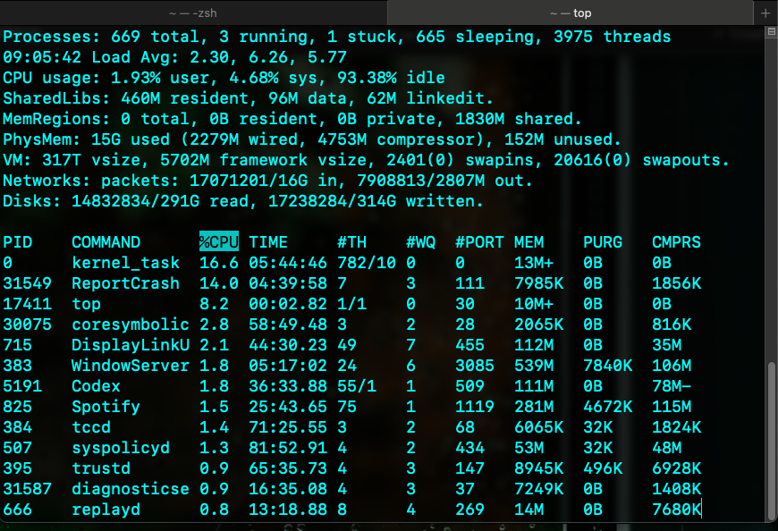

# My dotfiles



This repo is a practical machine setup for macOS. It keeps a version controlled snapshot of the tools, Codex configuration, Git settings, Terminal.app appearance, and a few shell shortcuts I want to carry from one Mac to the next.

It is intentionally smaller than the original repo it came from. The goal is not to manage everything. The goal is to preserve the parts I actually use and make them easy to reinstall after a clean OS setup.

## What This Repo Manages

| Area | Stored here | Why it matters |
|------|-------------|----------------|
| Homebrew packages | `config/Brewfile` | Reinstall formulae, casks, and VS Code extensions |
| Codex setup | `config/codex/` | Keep AGENTS instructions, skills, and Codex config in version control |
| Terminal.app appearance | `home/terminal.plist` | Restore the Terminal look and profile settings I like |
| Git defaults | `home/.gitconfig`, `home/.global-gitignore` | Carry Git behavior and global ignore rules across machines |
| Shell shortcuts | `home/.aliases` | Keep useful Laravel, Git, and macOS aliases nearby |

## Quick Start

1. Clone the repo.

```bash
git clone git@github.com:williambeeler/dotfiles.git
cd ~/.dotfiles
```

2. Run the installer.

```bash
./install.sh
```

3. If you are using your own Git identity, open `home/.gitconfig` and replace any inherited name, email, or signing key values.

## What `install.sh` Does

When you run [install.sh](/Users/grayghost/Sites/dotfiles/install.sh), it performs the current machine bootstrap for this repo.

1. Installs everything listed in `config/Brewfile` with `brew bundle`.
2. Symlinks the Codex files into `~/.codex`.
3. Symlinks the Git files into your home directory.
4. Copies `home/terminal.plist` to `~/terminal.plist`.
5. Imports the saved Terminal.app preferences.

This makes the Brewfile and Terminal backup the canonical machine snapshot.

## Repo Layout

| Path | Purpose |
|------|---------|
| `install.sh` | Main install entry point |
| `backup.sh` | Refreshes the saved machine snapshot |
| `uninstall.sh` | Removes Brewfile managed packages and cleanup symlinks |
| `config/Brewfile` | Homebrew formulae, casks, and VS Code extensions |
| `config/codex/AGENTS.md` | Global Codex working instructions |
| `config/codex/config.toml` | Codex CLI defaults |
| `config/codex/skills/` | Version controlled Codex skills |
| `config/install-codex-symlinks.sh` | Helper that links Codex files into `~/.codex` |
| `config/install-home-symlinks.sh` | Helper that links Git files into your home directory |
| `home/.aliases` | Optional shell aliases you can source from your own shell config |
| `home/.gitconfig` | Git defaults and signing configuration |
| `home/.global-gitignore` | Global Git ignore rules |
| `home/terminal.plist` | Saved Terminal.app preferences |
| `SKILLS_GUIDE.md` | Plain English explanation of the available Codex skills |

## Daily Commands

| Command | What it does |
|---------|--------------|
| `./install.sh` | Rebuild the machine setup from this repo |
| `./backup.sh` | Save the current Terminal settings and Homebrew state back into the repo |
| `./uninstall.sh` | Remove Brewfile managed apps and linked config files |
| `brew bundle --file=config/Brewfile` | Reinstall the Brewfile contents manually |

## Laravel Friendly Aliases

The aliases file still leans Laravel and PHP, which is worth keeping because those are the shortcuts I am most likely to use in day to day work.

| Alias | Expands to |
|------|------------|
| `a` | `php artisan` |
| `phpunit` | `vendor/bin/phpunit` |
| `mfs` | `php artisan migrate:fresh --seed` |
| `pp` | `php artisan test --parallel` |
| `cda` | `composer dump-autoload -o` |
| `nah` | `git reset --hard; git clean -df` |

If I want these aliases active, I should source `~/.dotfiles/home/.aliases` from my personal `~/.zshrc` or other shell config.

## Homebrew Workflow

The Brewfile is treated as a rebuild list for the machine.

1. Install from it with:

```bash
brew bundle --file=~/.dotfiles/config/Brewfile
```

2. Refresh it after installing or removing apps with:

```bash
~/.dotfiles/backup.sh
```

3. Commit the updated file so the saved machine snapshot stays current.

Because the Brewfile was generated from the current machine, it may include more than command line tools. It can also include GUI apps and VS Code extensions.

## Codex Integration

This repo treats Codex as a first class part of the machine setup.

| File or folder | Purpose |
|----------------|---------|
| `config/codex/AGENTS.md` | Global instructions for how Codex should work with me |
| `config/codex/config.toml` | Codex model and reasoning defaults |
| `config/codex/laravel-php-guidelines.md` | Shared Laravel and PHP coding standards |
| `config/codex/skills/` | Reusable skills for coding, design, marketing, and workflow automation |

After install, these are linked into `~/.codex`, which means they are available across projects on the machine. Project specific `AGENTS.md` files can still add or override instructions inside individual repos.

For a human friendly overview of the available skills, see [SKILLS_GUIDE.md](/Users/grayghost/Sites/dotfiles/SKILLS_GUIDE.md).

## Terminal.app Backup and Restore

This repo stores the current Terminal.app configuration in `home/terminal.plist`.

That file exists so I can keep the Terminal look I already like, even after wiping the machine and reinstalling macOS.

The workflow is simple:

1. Customize Terminal.app until it looks right.
2. Run `./backup.sh`.
3. Commit the updated `home/terminal.plist`.
4. On a new machine, run `./install.sh` to import it.

## Git Setup Notes

The current Git config was inherited from the original repo and should be personalized before relying on it.

At minimum, review:

1. `user.name`
2. `user.email`
3. `user.signingkey`
4. `core.excludesfile`

Those values often need to be machine or person specific.

## VS Code and Editor Notes

This repo no longer carries Vim specific setup. The Homebrew snapshot can still include VS Code related items, and the Brewfile generated from the machine may also include VS Code extensions through `brew bundle dump`.

If I want to keep editor state beyond extensions, that would be a separate backup path from this repo.

## Keeping This Repo Current

When I change the machine setup, this is the normal maintenance cycle:

1. Install or remove tools.
2. Adjust Terminal.app if needed.
3. Run `./backup.sh`.
4. Review `config/Brewfile` and `home/terminal.plist`.
5. Commit the changes.

That keeps the repo aligned with the machine instead of letting the README and install scripts drift.

## Credits

This setup started from [Freek Van der Herten](https://github.com/freekmurze)'s dotfiles and has been reduced into a smaller, more personal machine snapshot. I will make edits to it often to add more functionality. 
